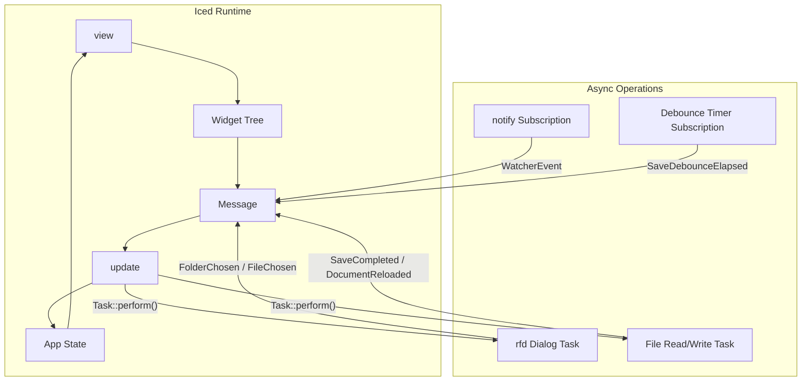

# Rust + Iced Local Markdown Reader/Writer

## Stack and Dependencies

The project targets **Iced 0.14.0** (latest stable) with these crates in `Cargo.toml`:

- `iced = { version = "0.14", features = ["markdown", "highlighter", "tokio"] }` -- GUI framework with markdown rendering and syntax highlighting
- `rfd = "0.15"` -- native file/folder dialogs
- `notify = "8"` -- cross-platform filesystem watcher
- `notify-debouncer-mini = "0.6"` -- debounced watcher events
- `walkdir = "2"` -- recursive directory traversal
- `anyhow = "1"` -- error handling
- `tokio = { version = "1", features = ["sync", "fs"] }` -- async runtime (needed by iced's tokio feature)

## Module Layout

```
src/
  main.rs           -- entry point, iced::application() setup
  app.rs            -- App struct, update(), view(), subscription()
  message.rs        -- Message enum
  state/
    mod.rs
    tree.rs          -- TreeNode, tree building/sorting
    document.rs      -- OpenDocument, dirty tracking
    selection.rs     -- Selection enum, RootContext
    dialogs.rs       -- DialogState for new file/folder
    status.rs        -- StatusState enum
  fs/
    mod.rs
    scan.rs          -- recursive folder scan, asset filtering, sorting
    load.rs          -- read markdown file from disk
    save.rs          -- debounced atomic save
    watch.rs         -- notify watcher subscription
    create.rs        -- create new file/folder on disk
  ui/
    mod.rs
    sidebar.rs       -- recursive tree view rendering
    toolbar.rs       -- top bar with actions, mode toggle, status
    content.rs       -- viewer (markdown widget) and editor (text_editor)
    dialogs.rs       -- modal/overlay for new file/folder name input
    statusbar.rs     -- bottom status bar
```

## Architecture (Elm Architecture)




## Key Design Decisions

### Markdown Rendering (Viewer Mode)

Use `markdown::parse(&text).collect::<Vec<Item>>()` to parse the in-memory string, then `markdown::view(&items, theme).map(Message::LinkClicked)` to render. Re-parse on every toggle to viewer (or cache the parsed items and invalidate on edit).

### Text Editing (Editor Mode)

Use `text_editor::Content` as the widget state, with a parallel `String` for saving/rendering. On `EditorAction`, call `content.perform(action)` and if `action.is_edit()`, mark dirty and extract text via `content.text()`.

### Auto-Save Strategy

- On edit: set `dirty = true`, reset a debounce flag
- Use an `iced::time::every(Duration::from_millis(250))` subscription that fires `SaveDebounceElapsed`
- On `SaveDebounceElapsed`: if dirty and enough time since last edit (250ms), spawn a `Task::perform()` to write the file
- Register the written path + timestamp for self-write suppression

### File Watcher Subscription

- Use `notify::RecommendedWatcher` wrapped in an `iced::Subscription` via `Subscription::run()`
- Create an async stream using `tokio::sync::mpsc` channel: watcher sends events to channel, subscription yields them as `Message::WatcherEvent`
- On watcher event: rescan tree for structural changes, reload current doc if its file changed (respecting self-write suppression window)

### Sidebar Tree Rendering

- Recursive function in `ui/sidebar.rs` that takes `&[TreeNode]` and `&HashSet<PathBuf>` (expanded set)
- Each category node: clickable row with expand/collapse icon + folder icon + name
- Each file node: clickable row with file icon + name
- Selected node gets highlight styling
- Indentation via nested `column![]` or padding

### Dialog for New File/Folder

- Use an iced overlay or a simple inline text input area that appears at the top of the content pane
- Text input + Confirm/Cancel buttons
- Validates name, appends `.md` if needed, checks for duplicates

## Implementation Milestones

### Milestone 1: Project Skeleton and Open Actions

- `cargo init`, set up `Cargo.toml` with all dependencies
- Create module structure with empty mod files
- Implement `App` struct with initial empty state
- Toolbar with "Open Folder" and "Open File" buttons
- Use `rfd::AsyncFileDialog` via `Task::perform()` to open native dialogs
- Display empty state with guidance text

### Milestone 2: Tree Scanning and Sidebar Navigation

- Implement `fs/scan.rs`: recursive walk with `walkdir`, skip `asset` dirs, collect `.md` files, sort folders-first then alphabetically
- Build `Vec<TreeNode>` from scan results
- Implement `ui/sidebar.rs`: recursive tree rendering with expand/collapse
- Wire up `TreeNodeToggled`, `CategorySelected`, `FileSelected` messages
- Auto-select `README.md` or first file on folder open

### Milestone 3: Document Display (Viewer + Editor)

- Implement viewer mode: parse markdown text with `markdown::parse()`, render with `markdown::view()`
- Implement editor mode: `text_editor::Content` widget with `on_action()`
- Mode toggle button in toolbar
- Keep `String` mirror in sync with editor content
- Category detail view when a folder is selected

### Milestone 4: Auto-Save

- Track `dirty` and `last_edit_time` in `OpenDocument`
- Subscription-based debounce timer (250ms)
- `Task::perform()` for async file write
- Status indicator: Idle / Saving... / Saved / Error
- Self-write suppression: store path + SystemTime of last write
- Flush pending save on app close

### Milestone 5: File Watching

- Implement `fs/watch.rs`: `notify::RecommendedWatcher` as iced `Subscription`
- On structural events (create/delete/rename): rescan full tree, preserve expanded state
- On file modify event for current doc: reload if not dirty, show conflict banner if dirty
- Self-write suppression: ignore events within ~500ms window of our own saves
- Handle watcher initialization failure gracefully

### Milestone 6: Create Actions

- "New Markdown File" and "New Folder" buttons visible when category selected
- Input dialog with name validation
- `fs/create.rs`: create file/folder on disk
- Post-create: refresh tree, expand ancestors, select new item, switch to editor mode for new files

### Milestone 7: Hardening and Polish

- Conflict resolution UI (reload from disk vs keep local)
- Deleted file handling (clear selection, show empty state)
- Permission error handling (non-fatal banner)
- Edge cases: empty folders, no markdown files, Unicode filenames, `.MD` extension
- Status bar with file path, save state, watcher status
- Keyboard shortcuts (Ctrl+O for open, Ctrl+E for toggle mode)

